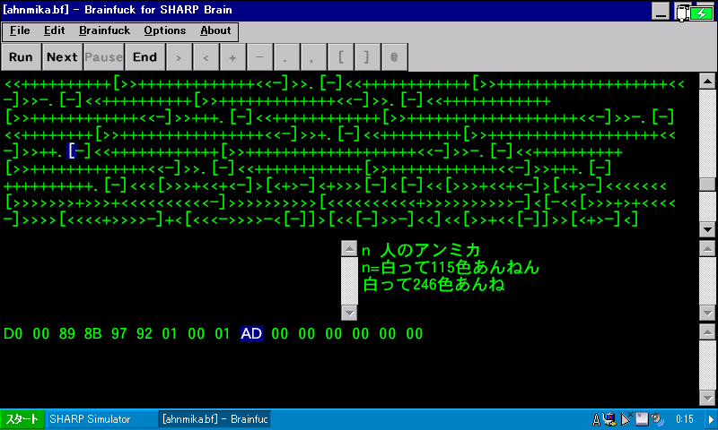

# Brain fuck

**Brain fuck** is a **Brain**fuck interpreter for [SHARP **Brain**](https://jp.sharp/edictionary/). This interpreter is "nice" in terms of [this specification](http://www.muppetlabs.com/~breadbox/bf/standards.html).

## Specs
Default options are shown in **bold** typeface. For I/O charset, UTF-8 is default for input and ASCII is default for output.

|Item|Spec|
|:-:|:-:|
|Memory type|**8-bit two's-complement integer (-128 to 127)**, 8-bit integer (0 to 255)|
|Memory length|**infinity (your device's memory capacity)**|
|I/O charset|**ASCII, UTF-8**, Shift\_JIS|
|Input error|**input 0**, input FF, error|
|Integer overflow|**wrap around**, error|
|Debugging|Break on `@` (disabled by default)|

"error" options are useful for debugging and portability check.
