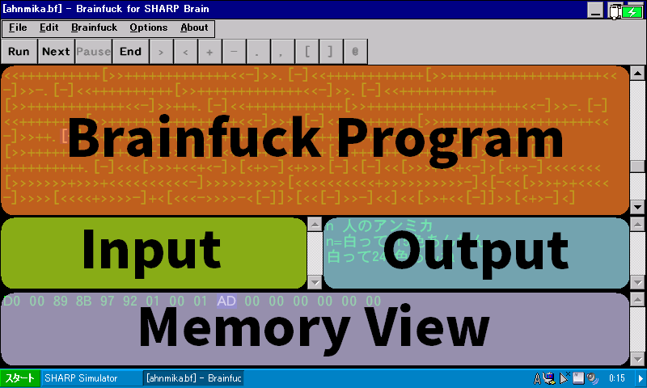

# Brainfuck for SHARP Brain

**Brain**fuck interpreter and debugger for [SHARP **Brain**](https://jp.sharp/edictionary/). This interpreter is "nice" in terms of [this specification](http://www.muppetlabs.com/~breadbox/bf/standards.html).


The Brainfuck program executed in this demo image is taken from [ahnmika-white](https://github.com/yude/ahnmika-white/blob/main/main.bf), which is licensed under the [MIT License](https://github.com/yude/ahnmika-white/blob/main/LICENSE) by [@yude](https://github.com/yude).

## Specs

Default options are shown in **bold** typeface.

|       Item       |                                    Spec                                    |
| :--------------: | :------------------------------------------------------------------------: |
|   Memory type    | **8-bit two's-complement integer (-128 to 127)**, 8-bit integer (0 to 255) |
|  Memory length   |                              **65,536 bytes**                              |
|   I/O charset    |                            **UTF-8**, Shift_JIS                            |
|   Input error    |                        **input 0**, input FF, error                        |
| Integer overflow |                           **wrap around**, error                           |
|    Debugging     |                     Break on `@` (disabled by default)                     |

"error" options are useful for debugging and portability check.

## Features

- **Behavior Adjustment**
  - **Run any Brainfuck programs.** You can tune all behaviors listed above.
- **Real Time Debugging**
  - Your program doesn't work as expected? It's tough to see how the program runs? This interpreter shows **the next instruction to execute and memory internals**. Also, it can highlight **where the memory pointer is**. You can also do a **step execution** or enable **breakpoint instruction (`@`)** to further inspect what's going on.
- **Speed Adjustment**
  - You can select either **100 ms, 10 ms, 1 ms, or fastest** speed to run a program. You can also disable the Real Time Debugging to further speedup the execution.
- **Screen Keyboard**
  - Your device doesn't have a good keyboard for Brainfuck programming? This interpreter offers you **buttons to type Brainfuck instructions with no hassle.**
- **Light/Dark Theme**
  - Tired to code in a bright screen? The dark theme isn't for you? This interpreter supports **both the light and dark themes**.
- **Per Monitor High DPI Aware V2**
  - Your display is a high DPI one? You have muitiple display devices that have different DPIs each other? This interpreter **smartly adjusts its size** according to the DPI setting for the display device where the interpreter is on and perfectly works on these environment **with no blur**.
- **Switch Layout**
  - Your device is wide? Or rather portrait? This interpreter offers you **two layouts** to support both screens.
- **Lightweight and Runs on Old Devices**
  - For Windows CE, it's only **about 50 KB** and requires only **about 1 MB of RAM**. The Windows PC version is also tiny and runs perfectly even on **Windows XP**.
- **Targets Broad CPU Architectures**
  - For Windows CE, you can get **Arm, MIPS, SH3, SH4, and x86** versions including variations. Even for Windows PC, you can get **ARM32, ARM64, x86, and AMD64** versions.
- ...and more!

## System Requirements

- **Windows XP or later**
  - Tested on Windows XP and 11.
  - Might also work on older OSes like Windows 2000.
- **Windows CE .NET 4.0 or later**
  - Tested on SHARP Brain PW-SH1, which is Windows Embedded CE 6.0 (Armv5TEJ).
- **[Wine](https://www.winehq.org/)**
  - Tested the AMD64 version on Wine 7 and 8 on M2 MacBook Air (Rosetta 2).
  - I'm not aware of the exact version required, but newer is better.

## How To Use

Download appropriate one from **[Releases](https://github.com/watamario15/brainfuck-sharp-brain/releases)** and run it on your device. No installation needed. **For SHARP Brain, use an Armv4I version and follow the usual procedure, which is explained [here (Japanese)](https://brain.fandom.com/ja/wiki/%E3%82%A2%E3%83%97%E3%83%AA%E3%81%AE%E8%B5%B7%E5%8B%95%E6%96%B9%E6%B3%95) and [here (English)](https://www.hpcfactor.com/reviews/editorial/ceopener-sharp-brain/).**

You can also remove this app by just deleting it. It doesn't save anything outside.



**You write a program on the program editor, fill the input area if necesary, and press "Run" or "Next" to execute your program.** You can also use buttons to type Brainfuck instructions in. **To edit the program or input after starting an execution, press "End" to end the execution first.** Note that black (dark theme)/glayed (light theme) areas are locked and not editable, and gray (dark theme)/white (light theme) areas are editable.

You can tune the behavior and reach more features from the menu bar. They represents

- **File**: File features. New file, open file, save file...
- **Edit**: Editing features. Undo, redo, copy, paste, ...
- **Brainfuck**: Brainfuck language customization. Refer to the "Spec" section.
- **Options**: Customizations and features. Speed, memory view address, real time debugging, highlight next instruction and memory pointer, dark/light switch, layout, font, and wordwrap.
- **About**: About this program.

## How To Build

You can build this app in various ways.

### Build for Windows PC

- `win.sh`: Builds binaries using [MinGW_w64](https://www.mingw-w64.org/). Requires MinGW_w64 to be accessible from PATH.
  - Requires POSIX compliant environment.
  - Use `win.bat` for Windows build of MinGW_w64.
- `vs2022proj-pc/`: [Visual Studio 2022](https://visualstudio.microsoft.com/vs/) (not VSCode) solution and project. The free Community edition is enough. Just open the `.sln` file and build, with the C++ Desktop Development installed.
  - Requires Windows machine.

### Build for Windows CE (including SHARP Brain)

You probably want to read either [here (Japanese)](https://brain.fandom.com/ja/wiki/%E9%96%8B%E7%99%BA%E7%92%B0%E5%A2%83%E3%83%BBSDK) or [here (English)](https://www.hpcfactor.com/developer/) to set up your development environment first.

- `brain.sh`: Builds binaries using [CeGCC](https://max.kellermann.name/projects/cegcc/). Requires CeGCC to be accessible from PATH.
  - Requires POSIX compliant environment.
  - Use `brain.bat` for Windows build of CeGCC.
- `evc4proj/`: eMbedded Visual C++ 4.0 project. Just open the `.vcw` file and build, with a SDK installed.
  - Requires Windows machine.
  - I use the Standard SDK for Windows CE 4.0.
- `vs2005proj/` and `vs2008proj/`: Visual Studio 2005 and 2008 solution and project. Just open the `.sln` file and build, with the Smart Device Programmability installed.
  - Requires Windows machine.

### Source Hierarchy

```
├─ main.cpp / main.hpp : Entry point and global definitions
│  ├─ msg.cpp / msg.hpp : Message handlers
│  ├─ runner.cpp / runner.hpp : Brainfuck execution managers
│  ├─ ui.cpp / ui.hpp : UI functions
│  └─ wproc.cpp / wproc.hpp : Window procedures
│
├─ bf.cpp / bf.hpp : Brainfuck interpreter
│
├─ history.cpp / history.hpp : Undo/redo manager
│
├─ tokenizer.cpp / tokenizer.hpp : UTF-8/Shift_JIS tokenizers
│
├─ util.cpp / util.hpp : Utility functions
│
└─ resource.rc / resource.h : Resource
    ├─ app.ico : Application icon
    └─ app.manifest : Application manifest
```
